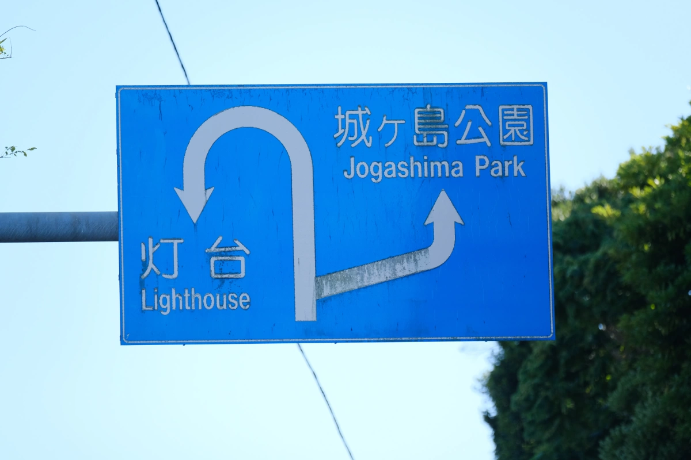

        <iframe
          width="90%"
          height="auto"
          style="max-width: 1200px; aspect-ratio: 16/9; border: none;"
          src="https://www.youtube.com/embed/xIYXtOsOrDc"
          allow="accelerometer; autoplay; clipboard-write; encrypted-media; gyroscope; picture-in-picture"
          allowfullscreen
        ></iframe>
      

　

## 首都圏の静かな漁港へ

今回の旅では、神奈川県の三浦・三崎港をめぐります。

映像学区が三浦半島にやってきたのは2回目です。かつての動画でペリー来航の地、浦賀をめぐりました。三浦半島といってもその表情は地域によって様々です。それは、狭い道路が山間を這う内陸部・東京湾を望む海岸部、のような単純なちがいではないと思います。浦賀・三崎・逗子、いずれも三浦半島の有名な海岸ですがどれも異なるおもしろさがあります。

三崎港は三浦半島の南の果てにある漁港です。新鮮な魚介をたのしめることは有名で、さきほど乗ってきた京急線には「みさきまぐろきっぷ」という、まぐろを楽しむための乗車券があるほど。でもどうせなら漁港の南に浮かぶ小さな自然島、城ヶ島の風景に足を伸ばしてみませんか？

　

## 夏空の城ヶ島大橋をわたる

三浦半島と城ヶ島のあいだには立派な横断橋が架かっています。徒歩でも渡れるので、風の穏やかな日には落ち着いて写真を撮ることができます。天候は恵まれ、一面の青空が広がりました。三浦半島の東と西を同時に眺められるのもここぐらいでしょうか。

城ヶ島大橋は1960年に開通してからずっと通行料が必要でしたが、2020年に無料化されました。二輪車のライダーさんも多いですね。ゆったりした2車線を軽快に通過していきます。

FUJIFILMのブルー・アクアが場を引き立てます。 今回使用したフィルムシミュレーションは「ASTIA」、ソフトな色味ながら彩りのある写真を楽しむことができます。 空気の湿り気とASTIAがここまで完璧にマッチするとは思いませんでした。夏の記憶を残すフィルムシミュレーションなら、これ一択。

  

    
  

  

    
  

  

    
  

  

    
  

  

    
  

  

    
  

　

## 絶壁の岩場をたどる

穏やかに晴れた海と険しい地形のコントラストが素晴らしく、いつまでファインダーを覗いていても飽きることはありません。ここはひとつ、人のにぎわいがない世界を切り取ってみようと思いました。海までくだる階段をずっとずっと下りていきましょう。

　

## 夕暮れの海を見下ろす

城ヶ島はアップダウンの激しい島なので、徒歩で楽しんでいるとあっという間に時間が過ぎていきます。お出かけの最後に城ヶ島大橋から夕焼けの西空を見渡すことにしましょう。潮風がすこし肌寒いですが、橋を歩く人はほとんど見かけないのでこの景色をひとり占めできます。

時間がなくて島の西側をまわることができませんでした。平たい磯場や神社、城ヶ島灯台があるそうです。機会があればまた訪れたいですね。

  

    
  

  

    
  

